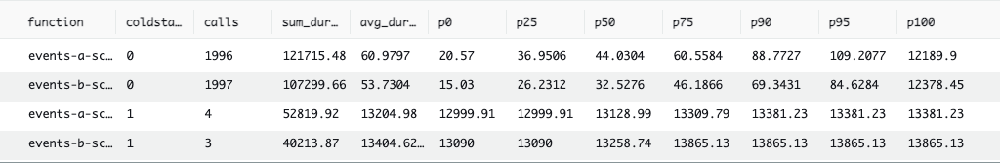

In this blog post, we examine the relative costs of different language runtimes
on AWS Lambda. Many languages can be used with AWS Lambda today, so we focus on
four that are interesting. We made the complete
[project](https://github.com/47deg/lambda) available on GitHub, because any
benchmarking claims that we make are frivolous without the supporting code for
potential peer review.

# Meet the contestants

* Rust: According to
  [StackOverflow](https://stackoverflow.blog/2023/01/26/comparing-tag-trends-with-our-most-loved-programming-languages/),
  Rust has been the most loved programming language among developers since
  [2019](https://insights.stackoverflow.com/survey/2019). Rust also features the
  best combination of performance and safety among mainstream languages, which
  naturally makes it an interesting choice for AWS Lambda.
* Scala: Xebia Functional has an extensive background in Scala development,
  including AWS Lambda development, using tools like
  [feral](https://github.com/typelevel/feral) to target both JVM and JavaScript
  runtimes.
* Python: Consistently one of the most widely used and sought languages in
  recent years, Datadog
  [reports](https://www.datadoghq.com/state-of-serverless/) that Python is one
  of the top choices for AWS Lambda development. We use
  [`mypy`](https://mypy-lang.org/) for the safety afforded by a static type
  system.
* TypeScript: Programming
  [equates](https://insights.stackoverflow.com/survey/2021#most-loved-dreaded-and-wanted-language-love-dread)
  to web programming for the majority of software developers, and JavaScript
  remains the most widely used programming language of them all. Node.js was
  born out of the desire to unify the whole development stack, and this
  technology is well supported for AWS Lambda. We use TypeScript for the same
  reason that we use `mypy`.

# For the fairest

Obviously, we want to be fair to each of the contestants, so first we must
formulate a suitable rubric.

* The specific contest should be framed around real-world use cases that drive
  businesses and solutions to AWS Lambda. In other words, the contest must be
  sincere and the resultant benchmarks should be useful and actionable.
* Wherever possible, the same implementation techniques should obtain for each
  contestant. When deviation is unavoidable, it must be described and justified.
* The implementation should use ordinary code, follow common algorithms, and
  adhere to sound practice. No implementation should fare better (or worse) than
  any other due to an abundance (or dearth) of cleverness.
* Official AWS SDKs should be used, not third-party alternatives.
* The total cost of reproducing the benchmarks should be small, in case anyone
  wants to reprise the contest for themselves.

# The contest

The contest comprises three services, arranged in a linear pipeline, and two
benchmark tests.

## The services

Here's the system diagram for our contest:


A user instigates the process by contacting the `https-a` generator service via
their web browser. The `https-a` service generates data bundles and posts them
to an on-demand [Kinesis](https://aws.amazon.com/kinesis/) event stream (`A`).
The `events-a` service pulls these events, processes them, and posts the results
to another on-demand Kinesis event stream (`B`). The `events-b` service pulls
these events and passes them straight through to
[DynamoDB](https://aws.amazon.com/dynamodb/) without further processing.

### `https-a`

This is a [generator](https://github.com/47deg/lambda/tree/main/rust/https-a-rs)
of Kinesis events, serving as the catalyst for the other services.

It's a simple web service that accepts:

* A `seed` parameter used to prime a pseudorandom number generator.
* A `chars` parameter that specifies the number of alphanumeric characters to
  generate pseudorandomly. The resultant _payload_ defines an arbitrary _work
  unit_ for heavy computational processing downstream. This payload is an
  abstract surrogate for some important data bundle in a real-world process. The
  parameter is tunable to accommodate different input sizes.
* A `hashes` parameter that specifies the number of times to iteratively hash
  each payload downstream. A cryptographic hash is used as an abstract surrogate
  for some compute-intensive process, e.g., LLM execution, signal processing,
  fluid dynamics simulation, protein folding simulation, code optimization,
  graph optimization, etc. The parameter is tunable to accommodate different
  algorithmic costs and complexities.
* A `messages` parameter that specifies how many Kinesis events to generate at
  once. The maximum injection size is 500.

JSON is the currency of our services. The generator produces JSON documents that
comprise:

* A UUID that labels the payload.
* The payload itself.
* The number of times to iteratively hash the payload.

Here's an example document, where `chars=1024` and `hashes=100`:

```json
{
	"uuid": "1115bcd4-95a4-4d1d-8d48-6769ae919cdc",
	"doc": "W7ckP4Mc1crUrkdKsxB8VTIwgGpaVnt8qOLhogAYYFU0r4HU1LY5PLWGJyuJWrX2UvZc4goASfnGZgtpWX7CkjsFag7ElQk4dKv8oufwi2OUH23yuxnk7ils51PHPRNOftyijP3FIAeW9m8NOPIweep0ylLt68XpAtAPAyDbNK26F5QJto0ri7fnj9eECN1f8xmbMZBckDz2sXKAuJmDg7ZgKyccLzzI9ZHhNMtOTaqfvXWpkfDYaV2aUvRcfzuMabDCEEoNpqzZE8tPQ1TBRa3Eqm56eYTTutJZuO1Jb94O",
	"hashes": 100
}
```

Note that the document does _not_ include the hash yet. The next service in the
pipeline performs the actual computation. The generator merely records the
volume of work to be done.

The generator posts its progeny to an on-demand Kinesis event stream,
uncreatively called `A`, from which the `events-a` service will consume.

For simplicity and expediency, we don't benchmark this service at all. We
therefore only need to implement it once and we can choose a language runtime
arbitrarily. We choose Rust.

### `events-a`

This service hashes items posted to event stream `A` and then posts results to
event stream `B`. We use [SHA3-512](https://en.wikipedia.org/wiki/SHA-3) as the
cryptographic hash function, partially because hardware acceleration is not as
readily available as with earlier algorithms in the SHA family. We initially
hash the pseudorandomly generated payload, then iteratively hash the successive
cryptographic digests until the target count is reached. So if a document
specifies `hashes=100`, there will be an initial payload hash followed by 99
digest hashes. The process is illustrated by this diagram:


The result is a variant of the incoming JSON document format, augmented by a
`hash` property:

```json
{
	"uuid": "1115bcd4-95a4-4d1d-8d48-6769ae919cdc",
	"doc": "W7ckP4Mc1crUrkdKsxB8VTIwgGpaVnt8qOLhogAYYFU0r4HU1LY5PLWGJyuJWrX2UvZc4goASfnGZgtpWX7CkjsFag7ElQk4dKv8oufwi2OUH23yuxnk7ils51PHPRNOftyijP3FIAeW9m8NOPIweep0ylLt68XpAtAPAyDbNK26F5QJto0ri7fnj9eECN1f8xmbMZBckDz2sXKAuJmDg7ZgKyccLzzI9ZHhNMtOTaqfvXWpkfDYaV2aUvRcfzuMabDCEEoNpqzZE8tPQ1TBRa3Eqm56eYTTutJZuO1Jb94O",
	"hashes": 100,
	"hash": "38BCD7FB1629C1F1596186969928120E6C7A4ACABBEF1A6A26EE3835D0BACCB616FB6F1030FADA1852BD67CB6B557E1C661C71112227CC060114E777F44DECF9"
}
```

### `events-b`

This service simply accepts items posted to event stream `B` and passes them
verbatim to DynamoDB. We endeavor to perform as little work as possible, with
maximum parallelism and asynchrony for insertion. So wherever possible, we
invoke the database insertion API asynchronously, once for each outgoing item,
and then we gang the futures together and await their aggregate completion.

## Measurement

Now that we've examined the structure of the contest, let's dive into the
evaluation criteria. We want apples-to-apples comparison wherever possible, but
we are willing to commit additional resources if they are required for any
particular contestant to complete its tasks. Additional resources incur
additional costs on the platform, so we note wherever variations are unavoidable
and we document the effect of any such adjustments on final cost.

Let's establish the baseline metrics:

1. Each lambda is given 128MB RAM. This keeps execution of the services
   inexpensive. We assume that increases in available memory will improve
   compute performance by reducing OS paging, deallocator overhead or garbage
   collector thrash, and so forth. Naturally, increased memory commitment is a
   second cost axis on the platform, so any real-world deployment scenario
   needs to investigate where the sweet spot is.
2. Each lambda is given 15 minutes to run. For the volume of work under
   consideration this is a vast overabundance of time, which is perfect for
   avoiding double counting compute time due to execution timeouts and function
   retries.
3. Each lambda uses dedicated Kinesis streams and DynamoDB tables, lest
   function interaction in the middleware layer complicate the analysis.
4. Each lambda processes a total of 2,000 incoming events. We direct the
   generator to inject events into event stream `A` in batches of 500.
5. Where we don't provide configuration values, we use the defaults. This
   simplicity makes it easier to set up the experiment and produce the
   benchmarks.

## Benchmarks

We compute two different benchmarks:

1. The maximum event batch size for `events-a` and `events-b` is set to 1. This
   case is not at all representative of real-world use cases, but minimizes
   variability and nondeterminism when taking measurements. It allows us to
   extrapolate a kind of idealized unit cost. We refer to this as _benchmark #1_
   is the results below.
2. The maximum event batch size for `events-a` and `events-b` is set to 64. This
   case more closely aligns with real practice. The associated variances are
   present in almost all real-world use cases, so this gives us insight into
   typical patterns. We refer to this as _benchmark #2_ in the results below.

We use the following [Cloudwatch](https://aws.amazon.com/cloudwatch/) [Logs
(CWL)
Insights](https://docs.aws.amazon.com/AmazonCloudWatch/latest/logs/CWL_QuerySyntax.html)
query to define the benchmarks themselves:

```text
filter @type = "REPORT"
| parse @log /\d+:\/aws\/lambda\/(?<function>.*)/
| stats
  count(*) as calls,
  sum(@duration + coalesce(@initDuration, 0)) as sum_duration,
  avg(@duration + coalesce(@initDuration, 0)) as avg_duration,
  pct(@duration + coalesce(@initDuration, 0), 0) as p0,
  pct(@duration + coalesce(@initDuration, 0), 25) as p25,
  pct(@duration + coalesce(@initDuration, 0), 50) as p50,
  pct(@duration + coalesce(@initDuration, 0), 75) as p75,
  pct(@duration + coalesce(@initDuration, 0), 90) as p90,
  pct(@duration + coalesce(@initDuration, 0), 95) as p95,
  pct(@duration + coalesce(@initDuration, 0), 100) as p100
  group by function, ispresent(@initDuration) as coldstart
| sort by coldstart, function
```

Let's break that down:

* The regular expression selects the target AWS Lambda function. We use it to
  select the appropriate implementations of `events-a` and `events-b`.
* We group the results by function and cold start indicator.
* All timings are given in milliseconds (ms).
* `function` is the function itself.
* `coldstart` is 1 if the function started cold and 0 if it started warm. During
  a [cold
  start](https://aws.amazon.com/blogs/compute/operating-lambda-performance-optimization-part-1/),
  AWS Lambda has to deploy the function internally and start an appropriately
  configured execution environment. Cold starts can be _much_ slower than warm
  starts, based on package size and language runtime.
* `calls` is the number of function invocations.
* `sum_duration` is the total billable time.
* `avg_duration` is the average billable time.
* `px` are performance percentiles. Specifically, `px` indicates that `x`% of
  the samples in the group finished within this time. So, 25% of the samples
  completed by the time given by `p25`, 50% completed
  by `p50`, and so forth.
* `p0` is therefore the minimum observed completion time for a sample in the
  group.
* And `p100` is therefore the maximum observed completion time for a sample in
  the group.

The _final score_ for each benchmark is the _sum of sums_ of four groups:

1. `events-a` warm start.
2. `events-b` warm start.
3. `events-a` cold start.
4. `events-b` cold start.

This score denotes the total billable compute time. This is the number that each
contestant wants to minimize, as it translates directly into reduced cost on the
AWS Lambda platform.

# The results

Okay, enough about process! Now, the moment you've been waiting for: it's time
to check out the juicy results. We caption the result tables with the
approximate final score.

## 4th place: Scala

<figure>
	
	<figcaption>
		Scala benchmark #1 results. Total time: ~322,599.50ms.
	</figcaption>
</figure>

<figure>
	
	<figcaption>
		Scala benchmark #2 results. Total time: ~171,061.43ms.
	</figcaption>
</figure>

We couldn't get Scala to perform either benchmark with only 128MB RAM, so we had
to give the function 512MB RAM to even compete. A quick trip to the
[AWS Lambda Pricing Calculator](https://s3.amazonaws.com/lambda-tools/pricing-calculator.html)
and some basic data entry demonstrate that quadrupling the memory quadruples the
memory-related cost — they are coupled linearly.

## 3rd place: TypeScript

<figure>
	
	<figcaption>
		TypeScript benchmark #1 results. Total time: ~567,580.83ms.
	</figcaption>
</figure>

<figure>
	
	<figcaption>
		TypeScript benchmark #2 results. Total time: ~305,289.89ms.
	</figcaption>
</figure>

## 2nd place: Python

<figure>
	
	<figcaption>
		Python benchmark #1 results. Total time: ~162,305.73ms.
	</figcaption>
</figure>

<figure>
	
	<figcaption>
		Python benchmark #2 results. Total time: ~80,930.31ms.
	</figcaption>
</figure>

The official AWS SDK for Python, [`boto3`](https://github.com/boto/boto3), does
not offer an asynchronous client. The network calls to the remote API are
inherently asynchronous, of course, but the client control flow is synchronous,
meaning that the function is penalized by having to wait for an API call to
complete before it can start the next one. There's an unofficial AWS SDK that
provides an asynchronous client,
[`aioboto3`](https://github.com/terrycain/aioboto3), but we eschewed its usage
in order to adhere to the rules we established above. Python does really well
despite this handicap, handily outperforming the other contestants so far.

## 1st place: Rust

<figure>
	
	<figcaption>
		Rust benchmark #1 results. Total time: ~43,458.59ms.
	</figcaption>
</figure>

<figure>
	
	<figcaption>
		Rust benchmark #2 results. Total time: ~18,735.37ms.
	</figcaption>
</figure>

But Rust is our crowned king of performance. Its one-at-a-time benchmark (#1)
outperforms Python's one-at-a-time benchmark by ~373%, and even outperforms
Python's 64-at-a-time benchmark (#2) by ~186%. And using a batch size of 64
improves the performance of Rust by another ~232%.

# Conclusion

Let's make these results a little more abstract as a prelude to making them more
concrete. For each of the two benchmarks, we declare that the first place score
represents one _compute cost unit_ and that 128MB RAM represents one _memory
cost unit_. We can now visualize the outcome simply.

## Benchmark #1: cost unit graphs

